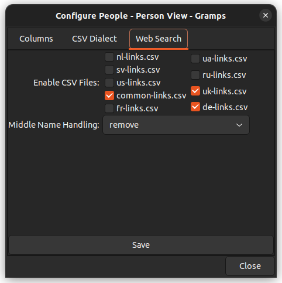

# WebSearch Gramplet

## 1. Purpose

This Gramplet allows you to load and display a list of genealogical websites, categorized by navigation types such as People, Places, and Sources. The websites are configured through CSV files that contain patterns for generating URLs, based on the genealogical data (such as name, birth year, death year, place, etc.). The Gramplet allows you to easily configure which CSV files to use and how middle names should be handled.

## 2. Navigation types and Supported Variables

### Navigation types
At the moment the Gramplet supports the following navigation types:
- **People**
- **Places**
- **Sources**
- **Families**

### Supported Variables
The Gramplet uses the following data keys:

#### People:

- `given`: This field represents the first name of a person.
- `middle`: Middle name. This field represents the middle name of a person. The handling of middle names is configurable, and the exact mechanics for extracting and displaying the middle name are described in more detail in the Settings section of the Gramplet. In the settings, you can choose how middle names should be processed, such as separating the first and middle names or removing the middle name entirely.
- `surname`: This field represents the primary surname of a person.
- `birth_year_from`: The start year of the birth date range or span. This field is used when specifying a range for the birth year. If you are not working with a date range but a single birth year, this field will contain the year of birth. In that case, the birth_year_to will be the same value, as both values will represent the same year.
- `birth_year`: This field is filled in only when the birth date is a single, specific year (i.e., not part of a date range). If the birth date is a range or span (e.g., "born between 1900 and 1910"), this field will remain empty. The birth_year_from and birth_year_to fields will contain the start and end years of the range, while birth_year will be left blank.
- `birth_year_to`: The end year of the birth date range or span. Similar to birth_year_from, this field is used to define a range. If you are not using a range and instead have a specific birth year, this field will be the same as birth_year_from, indicating that both fields represent the same year.
- `birth_year_before`: The latest possible birth year before a given date.
- `birth_year_after`: The earliest possible birth year after a given date.
- `death_year_from`: The start year of the death date range or span. This field is used when specifying a range for the death year. If the death year is a specific date rather than a range, this field will contain that year, and the death_year_to field will be identical.
- `death_year`: This field is filled in only when the death date is a specific year (not part of a range). If the death date is within a range (e.g., "died between 1950 and 1960"), the death_year field will be empty. In this case, death_year_from and death_year_to will contain the start and end years of the range, while death_year will be left blank.
- `death_year_to`: The end year of the death date range or span. Like death_year_from, this field is used for ranges. If you're dealing with a specific death year, this field will match death_year_from, as both will contain the same value for a single date.
- `death_year_before`: The latest possible death year before a given date.
- `death_year_after`: The earliest possible death year after a given date.
- `birth_place`: This field stores the place where the person was born. It corresponds to the specific location selected from the list of available places. It represents the direct birth place, which could be a city, town, or any defined geographical area.
- `death_place`: Similar to birth_place, this field stores the place where the person passed away. It corresponds to the specific location selected from the list of available places. It represents the direct death place, which could also be a city, town, or any other defined geographical location.
- `birth_root_place`: This field represents the "root" birth place, which is the highest-level location in the place hierarchy. The root birth place encompasses the birth_place, meaning it includes the broader geographic area (e.g., a region, state, or country) that the specific birth_place falls under. The birth_root_place helps identify the broader context or administrative region to which the birth place belongs.
- `death_root_place`: Just like birth_root_place, this field represents the "root" death place, which is the highest-level location in the place hierarchy. It encompasses the death_place, representing the broader geographic region (e.g., region, state, or country) that the death_place is part of. The death_root_place provides context for the death_place by identifying the larger geographical area or administrative region it belongs to.

- `locale`: The system locale detected in Gramps.

#### Places:

- `place`: This field stores the name of the specific place. It represents a location that can be used for various purposes in genealogy, such as identifying where an event (birth, death, marriage, etc.) occurred. The place can be any location, such as a city, town, village, or other defined geographical area, depending on the level of detail you need.
- `root_place`: This field represents the "root" place in the place hierarchy, which is typically the highest-level location in the geographical structure. While the place refers to a specific location, the root_place refers to the broader geographical area that includes the place. This root location could be a country, region, province, or any other high-level administrative area, depending on how places are organized in your hierarchy. The root_place helps give context to the `place by showing the larger geographical area to which it belongs.
- `latitude`: The latitude of the place, if available.
- `longitude`: The longitude of the place, if available.
- `type`: The type of the place (e.g., city, village, region, etc.).
- `title`: The hierarchical title representation of the place.

- `locale`: The system locale detected in Gramps.

#### **Families**
The Gramplet WebSearch supports navigation for family records using the following variables:

- `father_given` – This field represents the first name of the father.
- `father_middle` – Middle name. This field represents the middle name of the father. The handling of middle names is configurable, and the exact mechanics for extracting and displaying the middle name are described in more detail in the Settings section of the Gramplet.
- `father_surname` – This field represents the primary surname of the father.
- `father_birth_year_from` – The start year of the birth date range or span for the father. If a specific birth year is known, this field will contain that value.
- `father_birth_year` – This field is filled in only when the birth date is a single, specific year (i.e., not part of a date range). If the birth date is a range or span (e.g., "born between 1850 and 1860"), this field will remain empty.
- `father_birth_year_to` – The end year of the birth date range or span for the father. If a specific birth year is known, this field will be the same as `father_birth_year_from`.
- `father_birth_year_before` – The latest possible birth year before a given date.
- `father_birth_year_after` – The earliest possible birth year after a given date.
- `father_death_year_from` – The start year of the death date range or span for the father. If a specific death year is known, this field will contain that value.
- `father_death_year` – This field is filled in only when the death date is a single, specific year (i.e., not part of a range).
- `father_death_year_to` – The end year of the death date range or span for the father. If a specific death year is known, this field will be the same as `father_death_year_from`.
- `father_death_year_before` – The latest possible death year before a given date.
- `father_death_year_after` – The earliest possible death year after a given date.
- `father_birth_place` – The place where the father was born. Represents a direct birth place, which could be a city, town, or other defined geographical area.
- `father_death_place` – The place where the father passed away. Represents a direct death place, which could be a city, town, or other defined geographical location.
- `father_birth_root_place` – The "root" birth place, representing the highest-level location in the place hierarchy (e.g., a region, state, or country).
- `father_death_root_place` – The "root" death place, representing the highest-level location in the place hierarchy (e.g., a region, state, or country).

- `mother_given` – This field represents the first name of the mother.
- `mother_middle` – Middle name. This field represents the middle name of the mother, configurable in the Gramplet settings.
- `mother_surname` – This field represents the primary surname of the mother.
- `mother_birth_year_from` – The start year of the birth date range or span for the mother. If a specific birth year is known, this field will contain that value.
- `mother_birth_year` – This field is filled in only when the birth date is a single, specific year (i.e., not part of a date range).
- `mother_birth_year_to` – The end year of the birth date range or span for the mother. If a specific birth year is known, this field will be the same as `mother_birth_year_from`.
- `mother_birth_year_before` – The latest possible birth year before a given date.
- `mother_birth_year_after` – The earliest possible birth year after a given date.
- `mother_death_year_from` – The start year of the death date range or span for the mother. If a specific death year is known, this field will contain that value.
- `mother_death_year` – This field is filled in only when the death date is a single, specific year (i.e., not part of a range).
- `mother_death_year_to` – The end year of the death date range or span for the mother. If a specific death year is known, this field will be the same as `mother_death_year_from`.
- `mother_death_year_before` – The latest possible death year before a given date.
- `mother_death_year_after` – The earliest possible death year after a given date.
- `mother_birth_place` – The place where the mother was born. Represents a direct birth place, which could be a city, town, or other defined geographical area.
- `mother_death_place` – The place where the mother passed away. Represents a direct death place, which could be a city, town, or other defined geographical location.
- `mother_birth_root_place` – The "root" birth place, representing the highest-level location in the place hierarchy (e.g., a region, state, or country).
- `mother_death_root_place` – The "root" death place, representing the highest-level location in the place hierarchy (e.g., a region, state, or country).

- `marriage_year_from` – The start year of the marriage date range or span.
- `marriage_year` – This field is filled in only when the marriage date is a single, specific year (i.e., not part of a date range).
- `marriage_year_to` – The end year of the marriage date range or span.
- `marriage_year_before` – The latest possible marriage year before a given date.
- `marriage_year_after` – The earliest possible marriage year after a given date.
- `marriage_place` – The place where the marriage took place.
- `marriage_root_place` – The "root" place of the marriage, representing the highest-level location in the place hierarchy.

- `divorce_year_from` – The start year of the divorce date range or span.
- `divorce_year` – This field is filled in only when the divorce date is a single, specific year (i.e., not part of a date range).
- `divorce_year_to` – The end year of the divorce date range or span.
- `divorce_year_before` – The latest possible divorce year before a given date.
- `divorce_year_after` – The earliest possible divorce year after a given date.
- `divorce_place` – The place where the divorce took place.
- `divorce_root_place` – The "root" place of the divorce, representing the highest-level location in the place hierarchy.

- `locale` – The system locale detected in Gramps.

---
#### Sources:
- `source_title`: Source title.

- `locale`: The system locale detected in Gramps.

## 3. Configuration

### Configuring the Gramplet

The Gramplet has a configurable settings interface. To access it, click the button **"Configure the active view"** in the Gramplet's menu.

### Settings

Within the settings window, you can configure:

- **Enabled CSV Files**: Select which CSV files to use for loading websites.
- **Middle Name Handling**: Choose how middle names are handled. The available options are:
    - **Leave alone**: Leave the middle name unchanged.
    - **Separate**: Separate the first and middle names by a space.
    - **Remove**: Remove the middle name completely.

#### Screenshots of settings

## 4. User Interface

The Gramplet's interface consists of the following columns:

1. **Icon**: Displays the icon associated with the navigation type (e.g., People, Places, Sources). For common links, an icon of a star is displayed instead of the region.
2. **Locale**: Shows the locale or region associated with the website. This field can be sorted alphabetically to help organize links by region.
3. **Category**: Represents the category to which the website belongs. This field is sortable, allowing you to arrange links by their respective categories.  
   For ease of use, it is recommended to list the variables used in the URL template by their initial letters, as shown in the screenshot. This way, you can add several similar links with different sets of input parameters and quickly navigate through them. This greatly simplifies the search and convenient use of different template variations.  
     
   For example, the letters shown in the screenshot represent:
  - **g** - Given name
  - **m** - Middle name
  - **s** - Surname
  - **b** - Birth year
  - **d** - Death year

4. **URL**: The generated URL based on the data of the active individual, place, or source. This field can be sorted alphabetically, helping you easily organize the list of URLs. By double-clicking on a URL, you can open the associated website directly.

### Tooltip Information

When hovering over a row in the table, the tooltip will display:
- **Category**: The category of the website.
- **Replaced**: The variables that were successfully replaced with data from the active entity.
- **Empty**: Variables that did not have values and were replaced to empty.
- **Comment**: Any comment associated with the website. These comments can be included in a separate column in the CSV file, allowing you to add additional context or information about each link.

## 6. Handling CSV Files

The CSV files are loaded from the directory `assets/csv/` inside the Gramplet's directory. The filenames must end with `.csv`, and each file should follow the following format:
The Gramplet will automatically load these files and display the URLs based on the active entity (Person, Place, Source, ...).

**Is Enabled**: This column in the CSV file allows the user to enable or disable individual links without deleting them. This provides flexibility to manage which links are active while keeping all the available URLs in the file.

### Enabling Files
You can select which CSV files to use by enabling or disabling them in the Gramplet's settings.

