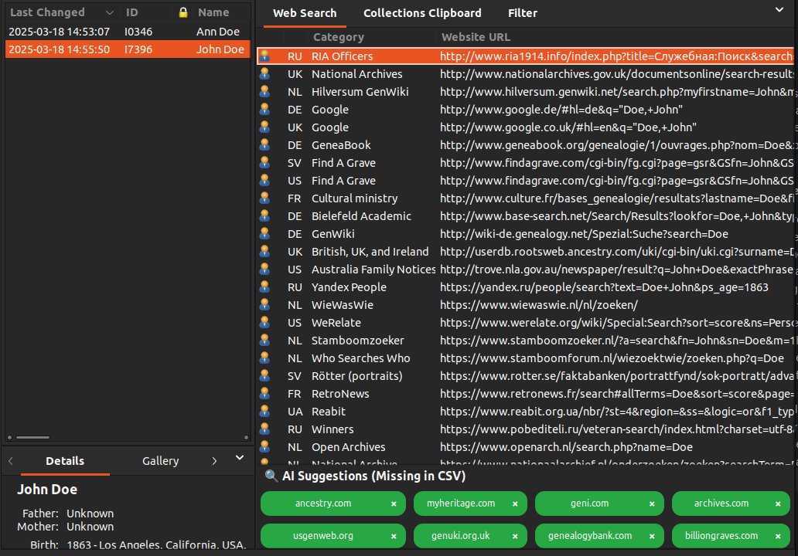
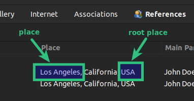
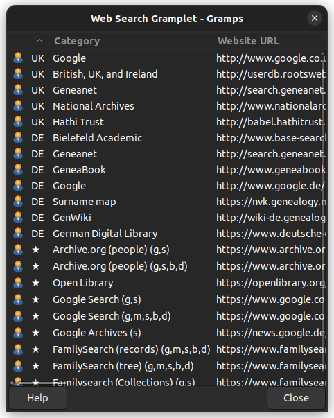
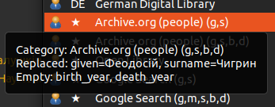

# WebSearch Gramplet

## 1. Purpose

This Gramplet allows you to load and display a list of genealogical websites, configured through CSV files. These files contain patterns for generating URLs based on genealogical data such as name, birth year, death year, place, etc. (referred to as **Variables** throughout this document).

Each time the user activates a person, place, or other entity in Gramps, the list of updated links is dynamically generated. (These entities are referred to as **Navigation Types** throughout this document). These links contain pre-filled search queries relevant to the selected subject. This enables the user to quickly access ready-made search links to gather additional information for their research.



## 2. Navigation types and Supported Variables

### 2.1. Navigation types
The Gramplet supports the following **Navigation Types**, which correspond to the main sections of Gramps:
- **People**
- **Places**
- **Sources**
- **Families**

Each **Navigation Type** has its own set of supported **Variables** that can be used in URL templates. These **Variables** act as placeholders in the URLs stored in CSV files. When using the Gramplet, they are automatically replaced with real data from the active entity (such as a person’s name, birth year, or place), allowing you to generate personalized search links instantly.

#### 2.1.1. **Variables** for the "People" **Navigation Type**:

- `given`: This field represents the first name of a person.
- `middle`: Middle name. This field represents the middle name of a person. The handling of middle names is configurable, and the exact mechanics for extracting and displaying the middle name are described in more detail in the Settings section of the Gramplet. In the settings, you can choose how middle names should be processed, such as separating the first and middle names or removing the middle name entirely.
- `surname`: This field represents the primary surname of a person.
- `birth_year_from`: The start year of the birth date range or span. This field is used when specifying a range for the birth year. If you are not working with a date range but a single birth year, this field will contain the year of birth. In that case, the birth_year_to will be the same value, as both values will represent the same year.
- `birth_year`: This field is filled in only when the birth date is a single, specific year (i.e., not part of a date range). If the birth date is a range or span (e.g., "born between 1900 and 1910"), this field will remain empty. The birth_year_from and birth_year_to fields will contain the start and end years of the range, while birth_year will be left blank.
- `birth_year_to`: The end year of the birth date range or span. Similar to birth_year_from, this field is used to define a range. If you are not using a range and instead have a specific birth year, this field will be the same as birth_year_from, indicating that both fields represent the same year.
- `birth_year_before`: The latest possible birth year before a given date.
- `birth_year_after`: The earliest possible birth year after a given date.
- `death_year_from`: The start year of the death date range or span. This field is used when specifying a range for the death year. If the death year is a specific date rather than a range, this field will contain that year, and the death_year_to field will be identical.
- `death_year`: This field is filled in only when the death date is a specific year (not part of a range). If the death date is within a range (e.g., "died between 1950 and 1960"), the death_year field will be empty. In this case, death_year_from and death_year_to will contain the start and end years of the range, while death_year will be left blank.
- `death_year_to`: The end year of the death date range or span. Like death_year_from, this field is used for ranges. If you're dealing with a specific death year, this field will match death_year_from, as both will contain the same value for a single date.
- `death_year_before`: The latest possible death year before a given date.
- `death_year_after`: The earliest possible death year after a given date.
- `locale`: The system locale detected in Gramps. Some examples of locale values: `en`, `de`, `fr`, `uk`, `es`, `it`, `pl`, `nl`, ...
- `birth_place`: This field stores the place where the person was born. It corresponds to the specific location selected from the list of available places. It represents the direct birth place, which could be a city, town, or any defined geographical area.
- `death_place`: Similar to `birth_place`, this field stores the place where the person passed away. It corresponds to the specific location selected from the list of available places. It represents the direct death place, which could also be a city, town, or any other defined geographical location.
- `birth_root_place`: This field represents the "root" birth place, which is the highest-level location in the place hierarchy. The `birth_root_place` encompasses the `birth_place`, meaning it includes the broader geographic area (e.g., a region, state, or country) that the specific `birth_place` falls under. The `birth_root_place` helps identify the broader context or administrative region to which the birth place belongs.
- `death_root_place`: Just like `birth_root_place`, this field represents the "root" death place, which is the highest-level location in the place hierarchy. It encompasses the `death_place`, representing the broader geographic region (e.g., region, state, or country) that the `death_place` is part of. The `death_root_place` provides context for the `death_place` by identifying the larger geographical area or administrative region it belongs to.

#### 2.1.2. **Variables** for the "Places" **Navigation Type**:

- `place`: The specific location associated with an event (e.g., birth, death, marriage). For a more detailed explanation, including a visual demonstration, see [**Variables for the "People" Navigation Type**](#211-variables-for-the-people-navigation-type).
- `root_place`: The highest-level location in the place hierarchy that encompasses the `place`. For a more detailed explanation, including a visual demonstration, see [**Variables for the "People" Navigation Type**](#211-variables-for-the-people-navigation-type).
- `latitude`: The latitude of the place, if available.
- `longitude`: The longitude of the place, if available.
- `type`: The type of the place (e.g., city, village, region, etc.).
- `title`: The hierarchical title representation of the place.
- `locale`: The system locale detected in Gramps. Some examples of locale values: `en`, `de`, `fr`, `uk`, `es`, `it`, `pl`, `nl`, ...

#### 2.1.3. **Variables** for the "Families" **Navigation Type**:

- `father_given` – This field represents the first name of the father.
- `father_middle` – Middle name. This field represents the middle name of the father. The handling of middle names is configurable, and the exact mechanics for extracting and displaying the middle name are described in more detail in the Settings section of the Gramplet.
- `father_surname` – This field represents the primary surname of the father.
- `father_birth_year_from` – The start year of the birth date range or span for the father. If a specific birth year is known, this field will contain that value.
- `father_birth_year` – This field is filled in only when the birth date is a single, specific year (i.e., not part of a date range). If the birth date is a range or span (e.g., "born between 1850 and 1860"), this field will remain empty.
- `father_birth_year_to` – The end year of the birth date range or span for the father. If a specific birth year is known, this field will be the same as `father_birth_year_from`.
- `father_birth_year_before` – The latest possible birth year before a given date.
- `father_birth_year_after` – The earliest possible birth year after a given date.
- `father_death_year_from` – The start year of the death date range or span for the father. If a specific death year is known, this field will contain that value.
- `father_death_year` – This field is filled in only when the death date is a single, specific year (i.e., not part of a range).
- `father_death_year_to` – The end year of the death date range or span for the father. If a specific death year is known, this field will be the same as `father_death_year_from`.
- `father_death_year_before` – The latest possible death year before a given date.
- `father_death_year_after` – The earliest possible death year after a given date.
- `father_birth_place` – The place where the father was born. Represents a direct birth place, which could be a city, town, or other defined geographical area.
- `father_death_place` – The place where the father passed away. Represents a direct death place, which could be a city, town, or other defined geographical location.
- `father_birth_root_place` – The "root" birth place, representing the highest-level location in the place hierarchy (e.g., a region, state, or country).
- `father_death_root_place` – The "root" death place, representing the highest-level location in the place hierarchy (e.g., a region, state, or country).
- `mother_given` – This field represents the first name of the mother.
- `mother_middle` – Middle name. This field represents the middle name of the mother, configurable in the Gramplet settings.
- `mother_surname` – This field represents the primary surname of the mother.
- `mother_birth_year_from` – The start year of the birth date range or span for the mother. If a specific birth year is known, this field will contain that value.
- `mother_birth_year` – This field is filled in only when the birth date is a single, specific year (i.e., not part of a date range).
- `mother_birth_year_to` – The end year of the birth date range or span for the mother. If a specific birth year is known, this field will be the same as `mother_birth_year_from`.
- `mother_birth_year_before` – The latest possible birth year before a given date.
- `mother_birth_year_after` – The earliest possible birth year after a given date.
- `mother_death_year_from` – The start year of the death date range or span for the mother. If a specific death year is known, this field will contain that value.
- `mother_death_year` – This field is filled in only when the death date is a single, specific year (i.e., not part of a range).
- `mother_death_year_to` – The end year of the death date range or span for the mother. If a specific death year is known, this field will be the same as `mother_death_year_from`.
- `mother_death_year_before` – The latest possible death year before a given date.
- `mother_death_year_after` – The earliest possible death year after a given date.
- `mother_birth_place` – The place where the mother was born. Represents a direct birth place, which could be a city, town, or other defined geographical area.
- `mother_death_place` – The place where the mother passed away. Represents a direct death place, which could be a city, town, or other defined geographical location.
- `mother_birth_root_place` – The "root" birth place, representing the highest-level location in the place hierarchy (e.g., a region, state, or country).
- `mother_death_root_place` – The "root" death place, representing the highest-level location in the place hierarchy (e.g., a region, state, or country).
- `marriage_year_from` – The start year of the marriage date range or span.
- `marriage_year` – This field is filled in only when the marriage date is a single, specific year (i.e., not part of a date range).
- `marriage_year_to` – The end year of the marriage date range or span.
- `marriage_year_before` – The latest possible marriage year before a given date.
- `marriage_year_after` – The earliest possible marriage year after a given date.
- `marriage_place` – The place where the marriage took place.
- `marriage_root_place` – The "root" place of the marriage, representing the highest-level location in the place hierarchy.
- `divorce_year_from` – The start year of the divorce date range or span.
- `divorce_year` – This field is filled in only when the divorce date is a single, specific year (i.e., not part of a date range).
- `divorce_year_to` – The end year of the divorce date range or span.
- `divorce_year_before` – The latest possible divorce year before a given date.
- `divorce_year_after` – The earliest possible divorce year after a given date.
- `divorce_place` – The place where the divorce took place.
- `divorce_root_place` – The "root" place of the divorce, representing the highest-level location in the place hierarchy.
- `locale` – The system locale detected in Gramps. Some examples of locale values: `en`, `de`, `fr`, `uk`, `es`, `it`, `pl`, `nl`, ...

#### 2.1.4. **Variables** for the "Sources" **Navigation Type**:
- `source_title`: Source title.
- `locale`: The system locale detected in Gramps. Some examples of locale values: `en`, `de`, `fr`, `uk`, `es`, `it`, `pl`, `nl`, ...

### 2.2 More details about some **variables**
#### 2.2.1 `place` VS `root_place`
To better understand the difference between `place` and `root place`, see the example below:



- The **place** (e.g., "Los Angeles") refers to the specific city, town, or village.
- The **root place** (e.g., "USA") represents the highest-level geographical entity containing the place.

#### 2.2.2 The `middle` **Variable**
The `middle` variable is not used everywhere. It represents the **middle name** of a person and is typically relevant in cultures and naming conventions where middle names play an important role.

##### **Who and when can use `middle`?**
- **Genealogical databases**: Some databases allow searching by full name, including the middle name, while others do not support it.
- **Legal and historical records**: Middle names may be crucial for distinguishing individuals with the same first and last names.
- **Regions where middle names are common**: Some cultures (e.g., the United States, Russia, Ukraine) frequently use middle names, while others may not.

##### **Configuring Middle Name Handling**
The way the `middle` variable is extracted from personal data **can be configured** in the settings interface. This setting is called **Middle Name Handling** and allows users to adjust how middle names appear in search queries.

For a more detailed explanation of this configuration, see the section [**config.ini – General Configuration**](#31-configini--general-configuration).

## 3. Configuration

The WebSearch Gramplet uses two configuration files, each serving a specific purpose:

- **`config.ini`** – Stores general settings for the Gramplet, such as enabled CSV files, middle name handling, URL compactness level, and integration with external services.
- **`attribute_mapping.json`** – Defines rules for extracting and mapping attributes from Gramps entities to URL variables.

These configuration files are located in the `configs` directory:

### 3.1. config.ini – General Configuration

The `config.ini` file contains various settings that control how the Gramplet operates. Here are the key options:

- **`websearch.enabled_files`** – List of enabled CSV files that store website templates.
- **`websearch.middle_name_handling`** – Defines how middle names should be handled in URL templates:
    - **"leave alone"** – Keep the middle name unchanged.
    - **"separate"** – Separate the first and middle names with a space.
    - **"remove"** – Remove the middle name entirely.
- **`websearch.url_prefix_replacement`** – Replacement for URL prefixes (e.g., removing `https://www.`).
- **`websearch.show_short_url`** – If `true`, URLs are displayed in a shortened format.
- **`websearch.url_compactness_level`** – Controls how URLs are formatted:
    - **"shortest"** – Minimal URL, no prefix and no extra parameters.
    - **"compact_no_attributes"** – Compact format, excludes attributes.
    - **"compact_with_attributes"** – Compact format, includes attributes.
    - **"long"** – Full URL with all details.
- **`websearch.use_openai`** – If `true`, enables integration with OpenAI for website recommendations.
- **`websearch.openai_api_key`** – API key for OpenAI services (if used).

These settings can be modified manually in `config.ini` or through the Gramplet's settings interface. Most settings take effect immediately. However, the following two options require a restart, as OpenAI is only initialized once when the application starts:

- **`websearch.use_openai`** –
- **`websearch.openai_api_key`**

For details on how OpenAI is used, the costs associated with it, and what data is transmitted, see the [OpenAI Integration](#openai-integration) section.

### 3.2. attribute_mapping.json – Attribute Mapping Rules

The `attribute_mapping.json` file defines how attributes from Gramps navigation types are mapped to URL variables. It ensures that specific fields (such as user-defined attributes) are correctly included in search queries.

Each entry follows this structure:

```json
[
  {
    "nav_type": "People",
    "attribute_name": "Military Service",
    "url_regex": ".*army.*",
    "variable_name": "military"
  },
  {
    "nav_type": "Places",
    "attribute_name": "Old Name",
    "url_regex": ".*historic.*",
    "variable_name": "old_name"
  }
]
```

- **`nav_type`** – The navigation type to which the attribute belongs (`People`, `Places`, `Sources`, etc.). **Currently, only attributes for `People` are supported.**
- **`attribute_name`** – The name of the attribute in Gramps.
- **`url_regex`** – A regular expression to match relevant URLs.
- **`variable_name`** – The name of the variable that will be substituted in the URL template.

After making changes, restart Gramps for them to take effect.
More details on how this mechanism works, including how identifiers from attributes are used in links, can be found [here](#how-attribute-mapping-works).

#### 3.2.1. How Attribute Mapping Works

The URL templates added in CSV files are **validated against the specified regex patterns**. If a URL matches a defined pattern, the system will check whether the active person has an attribute with the name specified in `attribute_name`.
- If such an attribute exists, a **new variable** will be created with the name specified in `variable_name`, containing the value from that attribute.
- This value will be inserted into the appropriate place in the URL from the CSV file.

##### Examples of Configuration and Expected Output

###### Example 1
_(Placeholder for explanation and illustration)_

###### Example 2
_(Placeholder for explanation and illustration)_

###### Example 3
_(Placeholder for explanation and illustration)_

## 4. User Interface



The Gramplet's interface consists of the following columns:

1. **Icon**: Displays the icon associated with the navigation type (e.g., People, Places, Sources). For common links, an icon of a star is displayed instead of the region.
2. **Locale**: Shows the locale or region associated with the website. This field can be sorted alphabetically to help organize links by region.
3. **Category**: Represents the category to which the website belongs. This field is sortable, allowing you to arrange links by their respective categories.  
   For ease of use, it is recommended to list the variables used in the URL template by their initial letters, as shown in the screenshot. This way, you can add several similar links with different sets of input parameters and quickly navigate through them. This greatly simplifies the search and convenient use of different template variations.  
     
   For example, the letters shown in the screenshot represent:
  - **g** - Given name
  - **m** - Middle name
  - **s** - Surname
  - **b** - Birth year
  - **d** - Death year

4. **URL**: The generated URL based on the data of the active individual, place, or source. This field can be sorted alphabetically, helping you easily organize the list of URLs. By double-clicking on a URL, you can open the associated website directly.

### Tooltip Information



When hovering over a row in the table, the tooltip will display:
- **Category**: The category of the website.
- **Replaced**: The variables that were successfully replaced with data from the active entity.
- **Empty**: Variables that did not have values and were replaced to empty.
- **Comment**: Any comment associated with the website. These comments can be included in a separate column in the CSV file, allowing you to add additional context or information about each link.


## 6. Handling CSV Files


The CSV files are loaded from the directory `assets/csv/` inside the Gramplet's directory. The filenames must end with `.csv`, and each file should follow the following format:
The Gramplet will automatically load these files and display the URLs based on the active entity (Person, Place, Source, ...).

**Is Enabled**: This column in the CSV file allows the user to enable or disable individual links without deleting them. This provides flexibility to manage which links are active while keeping all the available URLs in the file.

### Enabling Files
You can select which CSV files to use by enabling or disabling them in the Gramplet's settings.

## 7. OpenAI Usage

This section provides an overview of how OpenAI is integrated into the WebSearch Gramplet. It covers:
- **Usage of OpenAI**: The Gramplet interacts with OpenAI’s API to retrieve relevant genealogy websites based on user queries. The integration makes a **single API call** per request. OpenAI suggests **only those genealogy resources that are not already included** in the activated CSV files configured by the user.
- **Data Transmission**: OpenAI receives **only** the following information:
    - **Locales** from the CSV files used in WebSearch.
    - **A list of domains** from the activated CSV files.
    - **A list of domains that the user has marked as irrelevant**.
- **No data from the Gramps database is transmitted to OpenAI.**
- **Cost Considerations:** As of **March 18, 2025**, the average cost per request is **0.0091 USD** (0.91 cents). With this pricing, approximately **109 requests** can be made for **1 USD**.
- **Data Transmission**: When a request is made to OpenAI, the Gramplet sends a structured prompt describing the required genealogy resources.
- **Disabling OpenAI Integration:** Users can **disable** the use of OpenAI in the settings at any time. Additionally, they can remove the OpenAI API key from the configuration. When OpenAI is disabled, the **AI-generated suggestions section will no longer appear** in the lower part of the Gramplet.
- **Disclaimer:** The author assumes **no responsibility** for the use of OpenAI within this Gramplet. The user **accepts all risks** associated with its usage, whatever they may be. By enabling OpenAI integration, the user acknowledges and agrees that all interactions with OpenAI are subject to OpenAI’s terms of service and privacy policies.

